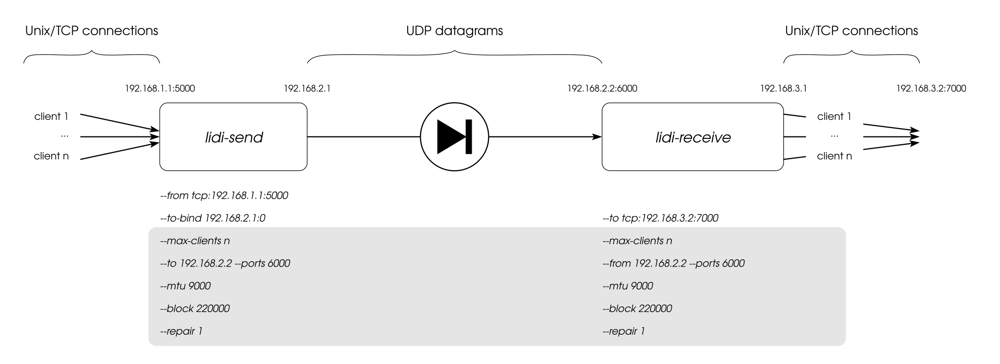

.. _Command line parameters:

Command line parameters
=======================

Lidi is configured through a combination of a TOML configuration file and command line arguments. Both ``lidi-send`` and ``lidi-receive`` share the same invocation model:

.. code-block:: none

   lidi-send    [OPTIONS] [config_file_path]
   lidi-receive [OPTIONS] [config_file_path]

The configuration file is an optional positional argument. When it is given, it is read first, then any command line argument overrides the corresponding value from the file. When no configuration file is given, values come from command line arguments and built-in defaults.

To display all available options for either part:

.. code-block:: bash

   $ lidi-send --help
   $ lidi-receive --help

When running with cargo, command line parameters must appear after the double-hyphen separator:

.. code-block:: bash

   $ cargo run --release --bin lidi-send -- --help

Configuration file format
-------------------------

The configuration file is a TOML file. Parameters common to both sides live at the top level, while side-specific parameters live in a ``[send]`` or ``[receive]`` table (only the table matching the running binary is used). Example configuration files are provided in the ``config_examples/`` directory of the repository.

.. code-block:: toml

   # Common parameters (must be identical on sender and receiver)
   mtu = 9000
   ports = [5001, 5002, 5003, 5004]
   block = 220000
   repair = 1
   max_clients = 2
   heartbeat = 10

   [send]
   from = [ "tcp:127.0.0.1:4000" ]   # data source endpoint(s)
   to = "127.0.0.1"                   # receiver IP address
   to_bind = "0.0.0.0:0"
   mode = "mmsg"

   [receive]
   to = [ "tcp:127.0.0.1:6000" ]      # data destination endpoint(s)
   from = "127.0.0.1"                 # IP to listen on for UDP packets
   mode = "mmsg"
   reset_timeout = 2

Every configuration-file key has a command line equivalent obtained by replacing underscores with hyphens (for example ``max_clients`` becomes ``--max-clients``).

Overview
--------

Here is a diagram of the components involved in an example usage of lidi, annotated with command line parameters:

.. note::
   Parameters that are displayed in the gray box must be the same on both sides (sender and receiver) of lidi. In particular the common parameters ``--mtu``, ``--ports``, ``--block`` and ``--repair`` have to be identical, and the receiver's ``--from`` address must match the sender's ``--to`` address.

Following, we provide some details about each parameter.

Endpoints (data sources and destinations)
-----------------------------------------

Data enters ``lidi-send`` and leaves ``lidi-receive`` through *endpoints*. An endpoint is described by a string starting with a ``tcp``, ``tls`` or ``unix`` prefix, optionally followed by ``[options]``, then the address:

.. code-block:: none

   tcp:<ip:port>              tcp[<options>]:<ip:port>
   tls:<ip:port>              tls[<options>]:<ip:port>
   unix:<socket path>         unix[<options>]:<socket path>

where the optional ``[...]`` part, placed immediately after the prefix, carries per-endpoint options separated by commas. Two options are supported:

- ``flush`` (default ``false``): on the sender side, encode and send a RaptorQ block after every ``read()`` instead of waiting for a full block; on the receiver side, flush the write buffer after every write. This is required for long-lived streams that never close (see :ref:`Sending UDP with Lidi`).
- ``hash`` (default ``false``): compute (sender) or verify (receiver) a hash of the transferred data. Requires the ``hash`` compilation feature.

Examples:

.. code-block:: none

   tcp:127.0.0.1:5000
   tcp[flush=true]:127.0.0.1:5000
   tls[flush=true,hash=true]:127.0.0.1:5000
   unix:/tmp/lidi.socket

On the sender side, one or several source endpoints are given with:

.. code-block:: none

   --from <endpoint>

On the receiver side, one or several destination endpoints are given with:

.. code-block:: none

   --to <endpoint>

The option may be repeated to declare several endpoints. In a configuration file, ``from`` (send) and ``to`` (receive) are TOML arrays of endpoint strings.

UDP transfer
------------

UDP transfer is the core of the diode.

On the sender side, the destination is the receiver's IP address or hostname:

.. code-block:: none

   --to <ip|hostname>

which defaults to ``127.0.0.1``. The source UDP socket is bound according to:

.. code-block:: none

   --to-bind <ip:port>

which defaults to ``0.0.0.0:0``. This default value should work in many cases.

On the receiver side, the option:

.. code-block:: none

   --from <ip|hostname>

defines the address to listen on for incoming UDP packets, and defaults to ``127.0.0.1``.

The UDP ports used for the transfer are common to both sides and are given as a comma-separated list:

.. code-block:: none

   --ports <port[,port]*>

which defaults to ``5000``. Using several ports enables multithreaded UDP send/receive (see `Multithreading`_ below). The list must be identical on both sides.

The method used to send and receive UDP datagrams can be selected with:

.. code-block:: none

   --mode <native|msg|mmsg>

When compiled with all UDP modes (the default), the default mode is ``mmsg`` (``sendmmsg`` / ``recvmmsg``), which batches datagrams for higher throughput.

Block and packet sizes
----------------------

To be transferred through the diode, data is sliced by lidi at different levels:

 - into `blocks` at the logical fountain codes level,
 - into `packets` at the UDP transfer level.

One can have an effect on the slicing sizes to achieve optimal performances by using several command line options. These parameters are common to both sides and must be set to the same values.

Firstly, the MTU can be set on both sides:

.. code-block:: none

   --mtu <nb_bytes>

The default MTU value is ``1500`` and can be increased (up to ``9000``, i.e. jumbo frames) when network devices allow for higher values. The minimum accepted value is ``1280`` (the IPv6 minimum MTU).

Then, on the logical level, fountain codes operate on blocks. Repair packets represent redundancy and are used by fountain codes to ensure data reconstruction despite packet loss:

.. code-block:: none

   --block <nb_bytes>

   --repair <percentage>

``--block`` defaults to ``220000`` bytes and ``--repair`` defaults to ``1`` (percent). The repair percentage must be strictly lower than ``100``.

See the :ref:`Tweaking parameters` chapter for more details on how to choose optimal values for your particular use case and devices.

Multiplexing
------------

Lidi can handle several transfers in parallel, so that a big data transfer doesn't prevent other data chunks from being handled. The maximal number of simultaneous client connections is configured on both sides with:

.. code-block:: none

   --max-clients <nb>

which has its default value set to ``2``.

Although not strictly required nor enforced by lidi, the number of clients on the sender side and on the receiver side will be equal in most use cases for better results.

Multithreading
--------------

To ensure data integrity through the UDP link, lidi uses RaptorQ fountain codes. Blocks of data are encoded (sender side) and decoded (receiver side). Encoding and decoding are parallelized across the UDP ports declared with ``--ports``: each port is served by its own send/receive worker, so declaring several ports spreads the RaptorQ computations over several threads.

Timeouts
--------

Since lidi uses the UDP protocol to transfer data, blocks and datagrams can be reordered or lost. Fountain codes are used to ensure data integrity despite reordering and losses. Also, it can be harder for the receiving part to know that a particular transfer is done, since an EOF-like marker can be received before the end of the data, or simply lost.

Thus, a configurable timeout is used on the receiver side to decide when to reset the RaptorQ internal state:

.. code-block:: none

   --reset-timeout <nb_secs>
     (receiver side, default: 2)

The receiver can also close a client connection when no data has been received for a client for a given duration:

.. code-block:: none

   --abort-timeout <nb_secs>
     (receiver side, disabled by default)

Queue sizes
-----------

On the receiver side, the internal pipeline queues can be bounded to limit memory usage. A value of ``0`` (the default) means unbounded:

.. code-block:: none

   --client-queue-size <nb>     Maximum number of RaptorQ blocks buffered per client
   --reblock-queue-size <nb>    Maximum items in the reblock pipeline queue
   --dispatch-queue-size <nb>   Maximum items in the dispatch pipeline queue
   --clients-queue-size <nb>    Maximum items in the clients pipeline queue

Heartbeat
---------

Since the purpose of the diode is to only allow one-way data traffic, the sender cannot be aware if a receiver is set up or not. But heartbeat messages can be regularly sent through the diode so that the receiver can be aware of a sender disconnection. The heartbeat interval is a common parameter, expressed in seconds:

.. code-block:: none

   --heartbeat <nb_secs>

A value of ``0`` (or leaving the parameter unset) disables the heartbeat entirely. When enabled, the sender sends a heartbeat block every ``nb_secs`` seconds, and the receiver warns whenever no heartbeat has been received for longer than that interval (the receiver adds a 25% grace period to account for latency and network load).

Logging
-------

The log verbosity of each side is set with:

.. code-block:: none

   --log <Off|Error|Warn|Info|Debug|Trace>
     (default: Info)

By default, logging is emitted on the terminal. When lidi is compiled with the ``log4rs`` feature, a `log4rs <https://docs.rs/log4rs/>`_ YAML configuration file can be provided to customize log routing (files, rotation, etc.):

.. code-block:: none

   --log4rs-config <path>

An example log4rs configuration is available at ``config_examples/lidi_log4rs.yml``.

Prometheus metrics
------------------

When lidi is compiled with the ``prometheus`` feature, an HTTP endpoint exposing Prometheus metrics can be enabled on each side with:

.. code-block:: none

   --prometheus-listen <ip:port>

The list of exported metrics is documented in ``doc/prometheus_metrics.md``.

TLS
---

When TCP data sources or destinations are declared as ``tls:`` endpoints, the TLS parameters are configured with the following options (or the ``[send.tls]`` / ``[receive.tls]`` tables in the configuration file):

.. code-block:: none

   --tls-key <path>           Path to the PEM private key file
   --tls-certificate <path>   Path to the PEM certificate file
   --tls-ca <path>            Path to the PEM accepted CA file
   --tls-min <version>        Minimum accepted TLS version (tls1_1, tls1_2, tls1_3)
   --tls-method <method>      TLS method (mozilla_intermediate_v4, mozilla_intermediate_v5,
                              mozilla_modern_v4, mozilla_modern_v5)
   --tls-ciphers <ciphers>    Accepted TLS ciphers
   --tls-groups <groups>      Accepted TLS groups

The default minimum version is ``tls1_3`` and the default method is ``mozilla_modern_v5``. When a CA file is provided, peer certificate verification is enforced (mutual TLS). A complete example is provided in ``config_examples/tls.config.toml``.
